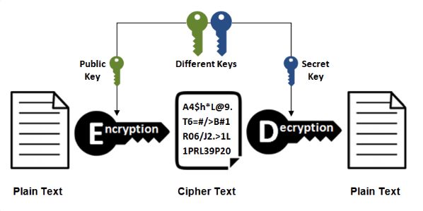

<!-- @import "[TOC]" {cmd="toc" depthFrom=1 depthTo=6 orderedList=false} -->

<!-- code_chunk_output -->

- [1. HTTPS 简介](#1-https-简介)
  - [1.1. 加密](#11-加密)
    - [1.1.1. 对称密钥加密](#111-对称密钥加密)
    - [1.1.2. 非对称加密](#112-非对称加密)
    - [1.1.3. HTTPS 采用的加密方式](#113-https-采用的加密方式)
  - [1.2. 认证](#12-认证)
  - [1.3. 完整性保护](#13-完整性保护)
  - [1.4. HTTPS 的缺点](#14-https-的缺点)
  - [1.5. 扩展](#15-扩展)
    - [1.5.1. 什么是 SSL ?](#151-什么是-ssl)
    - [1.5.2. 数据加密和数据签名的区别？](#152-数据加密和数据签名的区别)
  - [1.6. 参考链接](#16-参考链接)

<!-- /code_chunk_output -->

# 1. HTTPS 简介

HTTP 有以下安全性问题：

- 使用明文进行通信，内容可能会被窃听；
- 不验证通信方的身份，通信方的身份有可能遭遇伪装；
- 无法证明报文的完整性，报文有可能遭篡改。

HTTPS 并不是新协议，而是让 HTTP 先和 SSL（Secure Sockets Layer）通信，再由 SSL 和 TCP 通信，也就是说 HTTPS 使用了隧道进行通信。

通过使用 SSL，HTTPS 具有了加密（防窃听）、认证（防伪装）和完整性保护（防篡改）。

## 1.1. 加密

### 1.1.1. 对称密钥加密

对称密钥加密（Symmetric-Key Encryption），加密和解密使用同一密钥。

- 优点：运算速度快；
- 缺点：无法安全地将密钥传输给通信方。

### 1.1.2. 非对称加密

非对称密钥加密（ASYMMETRIC ENCRYPTION），又称公开密钥加密（Public-Key Encryption），加密和解密使用不同的密钥。

公开密钥所有人都可以获得，通信发送方获得接收方的公开密钥之后，就可以使用公开密钥进行加密，接收方收到通信内容后使用私有密钥解密。

非对称密钥除了用来加密，还可以用来进行**[签名]((#152-数据加密和数据签名的区别))**。因为私有密钥无法被其他人获取，因此通信发送方使用其私有密钥进行签名，通信接收方使用发送方的公开密钥对签名进行解密，就能判断这个签名是否正确。

- 优点：可以更安全地将公开密钥传输给通信发送方；
- 缺点：运算速度慢。

### 1.1.3. HTTPS 采用的加密方式

HTTPS 采用混合的加密机制，使用非对称密钥加密用于传输对称密钥来保证传输过程的安全性，之后使用对称密钥加密进行通信来保证通信过程的效率。（下图中的 Session Key 就是对称密钥）

> **混合加密：**由于非对称加密比对称加密要慢，所以我们就需要综合一下他们两者的优缺点，使他们共同使用，而这也是HTTPS采用的加密方式。在交换密钥阶段使用非对称加密方式，之后建立通信交换报文阶段则使用对称加密方式。

## 1.2. 认证

通过使用 **证书** 来对通信方进行认证。

数字证书认证机构（CA，Certificate Authority）是客户端与服务器双方都可信赖的第三方机构。

服务器的运营人员向 CA 提出公开密钥的申请，CA 在判明提出申请者的身份之后，会对已申请的公开密钥做数字签名，然后分配这个已签名的公开密钥，并将该公开密钥放入公开密钥证书后绑定在一起。

进行 HTTPS 通信时，服务器会把证书发送给客户端。客户端取得其中的公开密钥之后，先使用数字签名进行验证，如果验证通过，就可以开始通信了。

## 1.3. 完整性保护

SSL 提供报文摘要功能来进行完整性保护。

HTTP 也提供了 MD5 报文摘要功能，但不是安全的。例如报文内容被篡改之后，同时重新计算 MD5 的值，通信接收方是无法意识到发生了篡改。

HTTPS 的报文摘要功能之所以安全，是因为它结合了加密和认证这两个操作。试想一下，加密之后的报文，遭到篡改之后，也很难重新计算报文摘要，因为无法轻易获取明文。

## 1.4. HTTPS 的缺点

- 因为需要进行加密解密等过程，因此速度会更慢；
- 需要支付证书授权的高额费用。

## 1.5. 扩展

### 1.5.1. 什么是 SSL ?

SSL（安全套接字层），SSL由Netscape公司于1994年创建，它旨在通过Web创建安全的Internet通信。它是一种标准协议，用于加密浏览器和服务器之间的通信。它允许通过Internet安全轻松地传输账号密码、银行卡、手机号等私密信息。

SSL证书就是遵守SSL协议，由受信任的CA机构颁发的数字证书。使用SSL证书有许多好处：

- 保障服务器和浏览器之间的通信安全
- 验证网站的真实身份，区别于钓鱼欺诈网站
- 加密用户的敏感信息以确保安全
- 提高SEO搜索引擎排名
- 提升用户对网站的信任
- 有助于提高网站的在线销售业绩

### 1.5.2. 数据加密和数据签名的区别？

数据加密使用的是接受方的密钥对，任何知道接受方公钥的都可以向接受方发送消息，但是只有拥有私钥的才能解密出来；

数据签名使用的是发送方的密钥对，任何接收方都可以用公钥解密，验证数据的正确性。

**一句话总结：**

数据加密保证了数据接收方的数据安全性。

数据签名保证了数据发送方的数据安全性。

**举例A发送消息给B：**

1、A对信息签名的作用是确保这个信息是A发出的，不是别人发出的；
2、加密是对内容进行机密性保护，主要是保证信息内容不会被其他人获取，只有B可以获取。

也就是保证整个过程的端到端的唯一确定性，这个信息是A发出的（不是别人），且是发给B的，只有B才被获得具体内容（别人就算截获信息也不能获得具体内容）。

  这时A向B发送信息的整个签名和加密的过程如下：
1、A先用自己的私钥（PRI_A）对信息（一般是信息的摘要）进行签名。
2、A接着使用B的公钥（PUB_B）对信息内容和签名信息进行加密。

这样当B接收到A的信息后，获取信息内容的步骤如下：
1、用自己的私钥（PRI_B）解密A用B的公钥（PUB_B）加密的内容；
2、得到解密后的明文后用A的公钥（PUB_A）解密A用A自己的私钥（PRI_A）的签名。

从而整个过程就保证了开始说的端到端的唯一确认。A的签名只有A的公钥才能解签，这样B就能确认这个信息是A发来的；A的加密只有B的私钥才能解密，这样A就能确认这份信息只能被B读取。  

## 1.6. 参考链接

+ [【混合加密应用】HTTPS的加密过程](https://mp.weixin.qq.com/s?__biz=MzI4NjI2OTYwNg==&mid=2247484376&idx=1&sn=035a396e9c96d55f02f448cd14ccd1b3&chksm=ebdeca11dca943072a208f08568194cf57104d4bc52fa8ffe650ea2e76ef9122cd5d821d6874&mpshare=1&scene=22&srcid=1209Vsw0f1Z2HOxKnCIA632D#rd)
+ [数字签名是什么？](https://mp.weixin.qq.com/s?__biz=MzI4NjI2OTYwNg==&mid=2247484367&idx=1&sn=a8ff5f8d8785cb1b2e187a279d789095&chksm=ebdeca06dca94310fa90d3a079727cc5c19f8b72108f3a3f7d6605716638aae64402c35fb58a&scene=21#wechat_redirect)

