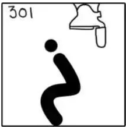

# HTTP状态码

## HTTP响应报文

服务器返回的 **响应报文** 中第一行为状态行，包含了状态码以及原因短语，用来告知客户端请求的结果。

| 状态码 | 类别                             | 含义                       |
| ------ | -------------------------------- | -------------------------- |
| 1XX    | Informational（信息性状态码）    | 接收的请求正在处理         |
| 2XX    | Success（成功状态码）            | 请求正常处理完毕           |
| 3XX    | Redirection（重定向状态码）      | 需要进行附加操作以完成请求 |
| 4XX    | Client Error（客户端错误状态码） | 服务器无法处理请求         |
| 5XX    | Server Error（服务器错误状态码） | 服务器处理请求出错         |

## 状态码详解

### 1XX 信息

+ **100 Continue** ：表明到目前为止都很正常，客户端可以继续发送请求或者忽略这个响应。

### 2XX 成功

- **200 OK**
- **204 No Content** ：请求已经成功处理，但是返回的响应报文不包含实体的主体部分。一般在只需要从客户端往服务器发送信息，而不需要返回数据时使用。
- **206 Partial Content** ：表示客户端进行了范围请求，响应报文包含由 Content-Range 指定范围的实体内容。

### 3XX 重定向

- **301 Moved Permanently** ：永久性重定向

- **302 Found** ：临时性重定向

- **303 See Other** ：和 302 有着相同的功能，但是 303 明确要求客户端应该采用 GET 方法获取资源。

- 注：虽然 HTTP 协议规定 301、302 状态下重定向时不允许把 POST 方法改成 GET 方法，但是大多数浏览器都会在 301、302 和 303 状态下的重定向把 POST 方法改成 GET 方法。
- **304 Not Modified** ：如果请求报文首部包含一些条件，例如：If-Match，If-Modified-Since，If-None-Match，If-Range，If-Unmodified-Since，如果不满足条件，则服务器会返回 304 状态码。
- **307 Temporary Redirect** ：临时重定向，与 302 的含义类似，但是 307 要求浏览器不会把重定向请求的 POST 方法改成 GET 方法。

### 4XX 客户端错误

- **400 Bad Request** ：请求报文中存在语法错误。

- **401 Unauthorized** ：该状态码表示发送的请求需要有认证信息（BASIC 认证、DIGEST 认证）。如果之前已进行过一次请求，则表示用户认证失败。
- **403 Forbidden** ：请求被拒绝。服务器已经理解请求，但是拒绝执行它；

- **404 Not Found**

### 5XX 服务器错误

- **500 Internal Server Error** ：服务器正在执行请求时发生错误。
- **503 Service Unavailable** ：服务器暂时处于超负载或正在进行停机维护，现在无法处理请求。

## 参考资料

+ [HTTP状态码趣味图解（中）](https://segmentfault.com/a/1190000019826151?utm_source=tag-newest)

+ [趣味图解HTTP状态码的含义](http://www.sohu.com/a/278045231_120014184)

