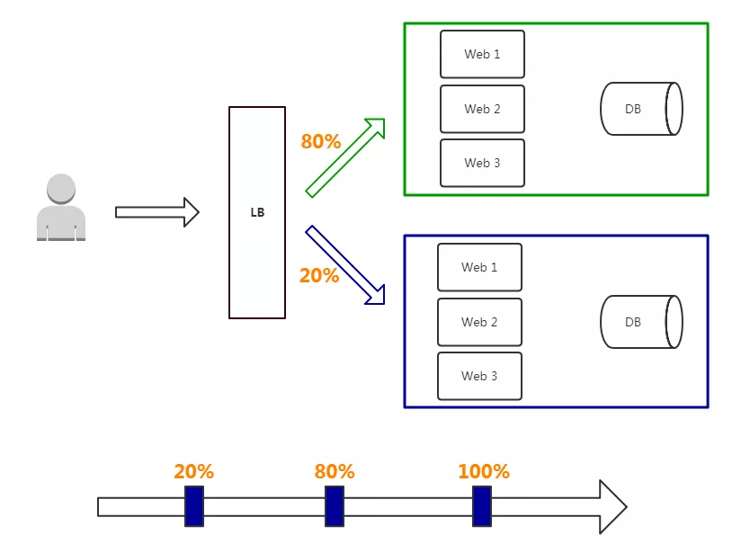

# 灰度升级
<!-- @import "[TOC]" {cmd="toc" depthFrom=1 depthTo=6 orderedList=false} -->

<!-- code_chunk_output -->

- [1. 前言](#1-前言)
- [2. 从“割接”到灰度升级](#2-从割接到灰度升级)
  - [2.1. 割接](#21-割接)
  - [2.2. 灰度发布](#22-灰度发布)
  - [2.3. 小结](#23-小结)
- [附录](#附录)
  - [金丝雀发布](#金丝雀发布)
  - [A/B测试](#ab测试)
  - [云原生](#云原生)
- [参考资料](#参考资料)

<!-- /code_chunk_output -->

## 1. 前言

应用程序升级面临最大挑战是新旧业务切换，将软件从测试的最后阶段带到生产环境，同时要保证系统不间断提供服务。

长期以来，业务升级渐渐形成了几个发布策略：蓝绿发布、灰度发布和滚动发布（[什么是蓝绿发布和滚动发布？](https://mp.weixin.qq.com/s/c6zCVGjg21UPdiNs2s6kFg)），目的是尽可能避免因发布导致的流量丢失或服务不可用问题。

## 2. 从“割接”到灰度升级

### 2.1. 割接

割接，顾名思义就是先割后接，把旧的设备割掉，再把新的接上去。

割接是对正运行的网络进行改造、升级、迁移等变更，会造成业务中断，稍有疏忽，就可能影响业务，甚至会酿成通信事故。

割接前要进行反复论证、周密测试、数据备份、失败紧急回退演练等，以规避割接风险。

割接时，通常选择在晚上零点之后进行，以减少对用户的影响，并要求每一个割接人员、每一个时间点、每一个步骤都必须精准、清晰落实，以保证次日凌晨前完成割接。

割接后，还要完成业务验证，不影响第二天的业务运营，才算割接完毕，如释重负！

一旦割接失败，最崩溃的是回退，比回退更崩溃的是回退失败，而比回退失败更更崩溃的是业务影响面积太大！

从固网到移动，从1G到4G，电信业经历了无数次新功能割接上线，而每一次操作对于通信工程师就像是上战场，对技术、体力、脑力、经验等是一次严峻的综合考验，不累趴下是不可能的。

  

电信业务升级割接这么辛苦，可微信、QQ经历了N个版本，为啥腾讯从不像运营商那样发一个割接公告，停了业务半夜做升级？

亚马逊每秒钟都在部署新软件，这些互联网巨头的新功能升级为啥如此轻松？

他们的秘密就是----**灰度升级**。

### 2.2. 灰度发布

> 灰度升级（又称灰度发布、灰度更新）指在黑与白之间，能够平滑过渡的一种发布方式。灰度发布不必一次性中断业务，它可在不影响已上线业务的前提下，在初始灰度的时候及时发现、调整问题，以保证平稳升级。[金丝雀发布](#金丝雀发布)
>
> 和[A/B测试](#A/B测试)都属于灰度发布方式。

灰度发布只升级部分服务，即让一部分用户继续用老版本，一部分用户开始用新版本，如果用户对新版本没什么意见，那么逐步扩大范围，把所有用户都迁移到新版本上面来。

**特点**

- 保证整体系统稳定性，在初始灰度的时候就可以发现、调整问题，影响范围可控；
- 新功能逐步评估性能，稳定性和健康状况，如果出问题影响范围很小，相对用户体验也少；
- 用户无感知，平滑过渡。

**缺点**

- 自动化要求高

**部署过程**

- 从LB摘掉灰度服务器，升级成功后再加入LB；
- 少量用户流量到新版本；
- 如果灰度服务器测试成功，升级剩余服务器。

灰度发布是通过切换线上并存版本之间的路由权重，逐步从一个版本切换为另一个版本的过程。

### 2.3. 小结

基于[云原生](#云原生)的灰度升级意味着我们不必“一次性割接”，DevOps支持循序渐进的引入新版本的VNF（虚拟化网络功能）组件，先挑选少量测试用户操作试点，将少量的流量切换到新版本上，并在这个过程中持续监控性能，确保稳定之后，再进一步将其他用户切换到新版本上。如果一旦发现少量测试用户的性能异常，也可快速回退到旧版本上，可大幅降低割接风险。 

终于核心网不用再熬夜辛苦升级割接了，采用灰度升级，大白天妥妥的就把事干了。

## 附录

### 金丝雀发布

由于金丝雀对空气中的甲烷和一氧化碳浓度十分敏感，约在18世纪时，人类已经知道用金丝雀来侦测危险气体了，矿工们将金丝雀带入矿井，如果金丝雀停止唱歌，就知道必须赶快撤离。

这就是金丝雀发布的由来，即先部署少量的新版本服务作为“金丝雀”来测试验证，确认整体稳定无异常后再全面部署。

### A/B测试

### 云原生

云原生是一套充分利用云环境优势来构建、测试、部署和运行软件的办法，其主要由微服务架构、DevOps、容器、动态编排等组成。

微服务架构将传统单体式应用程序分解为无状态（Stateless）、松散耦合、粒度更小的“微”服务，以提升应用部署的弹性。

DevOps让运维和开发人员共同协作发布服务（包括微服务），它创造了一种文化和环境，以快速、频繁且更可靠地构建、测试和发布服务，提高运作效率。

## 参考资料

+ [一文搞懂蓝绿发布、灰度发布和滚动发布](https://mp.weixin.qq.com/s/c6zCVGjg21UPdiNs2s6kFg)
+ [终于不再苦逼割接了，要灰度升级！](https://mp.weixin.qq.com/s/bwAAeVs-EQglShi-XLHYKQ)

