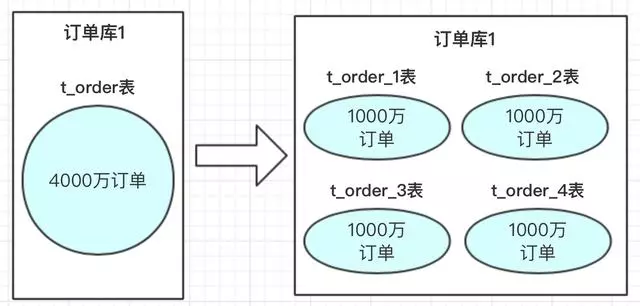
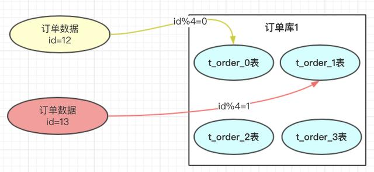
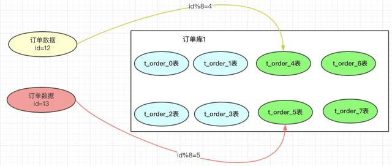
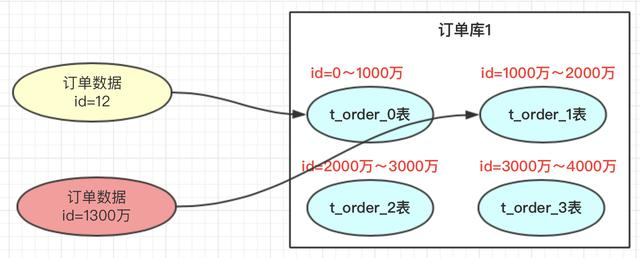

# 什么是数据库分库分表？

## 1. 前言

中大型项目中，一旦遇到数据量比较大，小伙伴应该都知道就应该对数据进行拆分了。**有垂直和水平两种**。

**垂直拆分**比较简单，也就是本来一个数据库，数据量大之后，从业务角度进行拆分多个库。如下图，独立的拆分出订单库和用户库。

**水平拆分**的概念，是同一个业务数据量大之后，进行水平拆分。

上图中订单数据达到了4000万，我们也知道 mysql 单表存储量推荐是百万级，如果不进行处理，mysql 单表数据太大，会导致性能变慢。使用方案可以参考数据进行水平拆分。把4000万数据拆分4张表或者更多。当然也可以分库，再分表；把压力从数据库层级分开。

### 1.1 垂直拆分和水平拆分区别

#### 1.1.1 垂直拆分

数据库的垂直拆分： **对业务表进行分类，不同的业务表划分到不同的数据库里**。这种形式的拆分往往是便随着服务化改造，按功能模块将原来强耦合的系统拆分为多个弱耦合的服务，此时往往就会进行数据库的垂直拆分。

数据表的垂直拆分： 是针对于数据表列的拆分，**把一张列比较多的表拆分为多张表**。

**垂直拆分的优点：**

- 数据库的拆分简单明了，拆分规则明确。
- 应用程序模块清晰明确，整合容易。
- 数据维护方便易行，容易定位。

**垂直拆分的缺点：**

- 部分表关联无法在数据库级别完成，需要在程序中完成。
- 单表大数据量仍然存在性能瓶颈。
- 事务处理相对更为复杂。
- 拆分达到一定程度之后，扩展性会遇到限制。

#### 1.1.2 水平拆分

把一个表的数据按照某种规则化分到不同表或数据库里（水平拆分是按照行数据拆分）。

**水平拆分的优点：**

- 解决单表单库大数据量和高热点访问性能遇到瓶颈的问题；
- 应用程序端整体架构改动相对较少。
- 事务处理相对简单。
- 只要切分规则能够定义好，基本上较难遇到扩展性限制。

**水平拆分缺点：**

- 拆分规则相对更复杂，很难抽象出一个能够满足整个数据库的切分规则。
- 后期数据的维护难度有所增加，人为手工定位数据更困难。
- 产品逻辑将变复杂。比如按年来进行历史数据归档拆分，这个时候在页面设计上就需要约束用户必须要先选择年，然后才能进行查询。

总而言之

1. 数据表垂直拆分： 单表复杂度。
2. 数据库垂直拆分： 功能拆分。
3. 水平拆分：分表：解决单表大数据量问题。 分库：为了解决单库性能问题。

## 2. 分库分表方案

分库分表方案中有常用的方案，**hash取模和range范围方案**；分库分表方案最主要就是路由算法，**把路由的key按照指定的算法进行路由存放**。接下来介绍一下两个方案的特点。

### 2.1 hash取模方案

在我们设计系统之前，可以先预估一下大概这几年的订单量，如：4000万。每张表我们可以容纳1000万，也我们可以设计4张表进行存储。

> 那具体如何路由存储的呢？hash的方案就是对指定的路由key（如：id）对分表总数进行取模，上图中，id=12的订单，对4进行取模，也就是会得到0，那此订单会放到0表中。id=13的订单，取模得到为1，就会放到1表中。为什么对4取模，是因为分表总数是4。

+ **优点**

订单数据可以**均匀的放到那4张表**中，这样此订单进行操作时，就**不会有热点问题**。

> **热点的含义：**热点的意思就是对订单进行操作集中到1个表中，其他表的操作很少。订单有个特点就是时间属性，一般用户操作订单数据，都会集中到这段时间产生的订单。如果这段时间产生的订单 都在同一张订单表中，那就会形成热点，那张表的压力会比较大。

+ **缺点**

将来的**数据迁移和扩容，会很难**。

如：业务发展很好，订单量很大，超出了4000万的量，那我们就需要增加分表数。如果我们增加4个表

一旦我们增加了分表的总数，取模的基数就会变成8，以前id=12的订单按照此方案就会到4表中查询，但之前的此订单时在0表的，这样就导致了数据查不到。就是因为取模的基数产生了变化。

遇到这个情况，我们小伙伴想到的方案就是做**数据迁移**，**把之前的4000万数据，重新做一个hash方案，放到新的规划分表中。也就是我们要做数据迁移。这个是很痛苦的事情**。有些小公司可以接受晚上停机迁移，但大公司是不允许停机做数据迁移的。

> 当然做数据迁移可以结合自己的公司的业务，做一个工具进行，不过也带来了很多工作量，每次扩容都要做数据迁移

那有没有不需要做数据迁移的方案呢，我们看下面的方案

###  2.2 range范围方案

range方案也就是以范围进行拆分数据。

range方案比较简单，就是把一定范围内的订单，存放到一个表中；**如上图id=12放到0表中，id=1300万的放到1表中。设计这个方案时就是前期把表的范围设计好。通过id进行路由存放。**

- **优点**

我们小伙伴们想一下，此方案是不是**有利于将来的扩容，不需要做数据迁移**。即时再增加4张表，之前的4张表的范围不需要改变，id=12的还是在0表，id=1300万的还是在1表，新增的4张表他们的范围肯定是 大于 4000万之后的范围划分的。

- **缺点**

**有热点问题**，我们想一下，因为id的值会一直递增变大，那这段时间的订单是不是会一直在某一张表中，**如id=1000万 ～ id=2000万之间，这段时间产生的订单是不是都会集中到此张表中，这个就导致1表过热，压力过大，而其他的表没有什么压力**。

## 总结

**hash取模方案**：没有热点问题，但扩容迁移数据痛苦

**range方案**：不需要迁移数据，但有热点问题。

那有没有一个方案，**即不需要迁移数据，又能解决数据热点的问题呢？**

